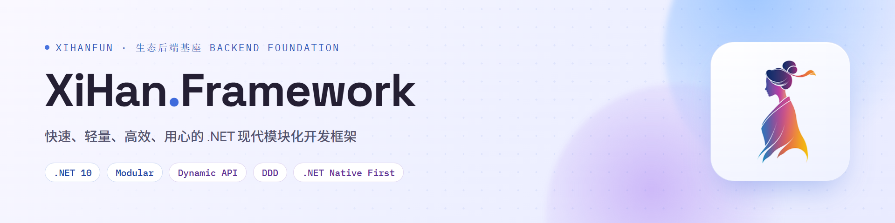

<div align="center">


<h1>XiHan.Framework</h1>

<p><b>快速、轻量、高效、用心的 .NET 模块化开发框架</b></p>

<p>基于 .NET 10 构建 · 66 个模块化组件 · <code>[DependsOn]</code> 依赖声明 · 拓扑排序加载</p>

<p>
  <a href="https://github.com/XiHanFun/XiHan.Framework/stargazers"></a>
  <a href="https://gitee.com/XiHanFun/XiHan.Framework"></a>
  <a href="https://gitcode.com/XiHanFun/XiHan.Framework"></a>
</p>
<p>
  
  
  
  <a href="https://www.nuget.org/packages?q=XiHan.Framework"></a>
  <a href="https://www.nuget.org/packages/XiHan.Framework.Core"></a>
</p>


<p>
  <a href="./LICENSE"></a>
  <a href="https://github.com/XiHanFun/XiHan.Framework/commits"></a>
  
  <a href="https://github.com/XiHanFun/XiHan.Framework/issues"></a>
  <a href="https://github.com/XiHanFun/XiHan.Framework/graphs/contributors"></a>
  
</p>

<p>
  <a href="https://deepwiki.com/XiHanFun/XiHan.Framework"></a>
  <a href="https://framework.docs.xihanfun.com"></a>
  <a href="https://qm.qq.com/q/qYp1Urv3z2"></a>
</p>
<p>
  <a href="https://trendshift.io/repositories/83128?utm_source=trendshift-badge&amp;utm_medium=badge&amp;utm_campaign=badge-trendshift-83128" target="_blank" rel="noopener noreferrer"></a>
</p>

</div>

## 概述

XiHan.Framework 是面向企业级应用的模块化后端框架，专为前后端分离的 ASP.NET Core 应用设计。框架优先使用 .NET 原生功能，减少第三方依赖，强调模块清晰、依赖可控、扩展可维护。通过 `[DependsOn]` 属性声明模块依赖，自动拓扑排序加载，以应用服务与动态 API 约定统一接口暴露方式。

## 文档

| 去处 | 内容 |
| --- | --- |
| [文档站](https://framework.docs.xihanfun.com) | 完整指南与 66 个包的逐包 API 文档 |
| [框架工程说明](./framework/README.md) | 分层架构、模块清单、目录结构、依赖关系 |
| [更新日志](https://framework.docs.xihanfun.com/changelog) | 各版本变更与升级须知 |
| [贡献指南](./CONTRIBUTING.md) | 分支约定、提交规范、本地构建与测试 |

## 设计原则

- **分层架构** - 遵循清晰的分层原则，避免循环依赖
- **依赖倒置** - 高层模块不依赖低层模块，都依赖抽象接口
- **单一职责** - 每个包只负责一个特定的功能领域
- **开闭原则** - 对扩展开放，对修改关闭，通过接口和抽象类支持自定义
- **优先 .NET 10** - 使用内置功能（DI、日志、序列化），仅在必要时引入第三方库
- **性能优化** - 利用 .NET 10 高性能特性；AOT 不在支持范围（核心依赖 SqlSugar / Castle DynamicProxy / Newtonsoft.Json 暂不兼容裁剪）

## 技术栈

| 类别 | 技术 |
| --- | --- |
| 运行时 | .NET |
| 语言 | C# |
| ORM | SqlSugarCore |
| 日志 | Serilog.AspNetCore |
| 缓存 | Microsoft.Extensions.Caching.Hybrid + StackExchangeRedis |
| AOP | Castle.Core (DynamicProxy) |
| 加密 | BouncyCastle.Cryptography |
| 序列化 | System.Text.Json（内置）+ Newtonsoft.Json |
| 模板引擎 | Scriban |
| AI | Microsoft.Extensions.AI + Microsoft.Agents.AI + MCP |
| HTTP 韧性 | Microsoft.Extensions.Http.Polly |
| gRPC | Grpc.AspNetCore |
| 实时通信 | ASP.NET Core SignalR |
| API 文档 | Scalar.AspNetCore + Swashbuckle.AspNetCore |
| IP 定位 | IP2Region.Net |
| 消息通知 | MailKit + Telegram.Bot |
| 搜索 | Elastic.Clients.Elasticsearch |
| 测试 | xunit.v3 + Microsoft.Testing.Platform（含 CodeCoverage 扩展） |

各依赖的具体版本以 `framework/src` 下各工程的 `PackageReference` 为准。

## 快速开始

### 安装

通过 NuGet 安装所需模块：

```bash
# 安装核心模块
dotnet add package XiHan.Framework.Core

# 安装 Web API 模块（包含完整中间件管道）
dotnet add package XiHan.Framework.Web.Api

# 安装 API 文档模块
dotnet add package XiHan.Framework.Web.Docs

# 安装数据访问模块
dotnet add package XiHan.Framework.Data
```

### 定义模块

每个模块继承 `XiHanModule`，通过 `[DependsOn]` 声明依赖：

```csharp
using XiHan.Framework.Core.Modularity;
using XiHan.Framework.Web.Api;
using XiHan.Framework.Data;

[DependsOn(
    typeof(XiHanWebApiModule),
    typeof(XiHanDataModule)
)]
public class MyAppModule : XiHanModule
{
    public override Task ConfigureServicesAsync(ServiceConfigurationContext context)
    {
        // 注册服务
        return Task.CompletedTask;
    }

    public override Task OnApplicationInitializationAsync(ApplicationInitializationContext context)
    {
        // 应用初始化
        return Task.CompletedTask;
    }
}
```

### 启动应用

```csharp
using XiHan.Framework.Core.Extensions.DependencyInjection;
using XiHan.Framework.Web.Core.Extensions.DependencyInjection;

var builder = WebApplication.CreateBuilder(args);
await builder.AddApplicationAsync<MyAppModule>();

var app = builder.Build();
await app.InitializeApplicationAsync();
await app.RunAsync();
```

### 模块生命周期

每个模块提供 7 个生命周期钩子，按拓扑排序顺序执行：

```text
服务注册阶段                          应用初始化阶段
┌──────────────────────┐            ┌───────────────────────────────┐
│ PreConfigureServices │            │ OnPreApplicationInitialization │
│ ConfigureServices    │     →      │ OnApplicationInitialization    │
│ PostConfigureServices│            │ OnPostApplicationInitialization│
└──────────────────────┘            └───────────────────────────────┘
                                                  ↓
                                    ┌───────────────────────────────┐
                                    │ OnApplicationShutdown          │
                                    └───────────────────────────────┘
```

## NuGet 包

所有模块均发布至 [NuGet.org](https://www.nuget.org/packages?q=XiHan.Framework)，包名与项目名一致：

```bash
# 搜索所有 XiHan.Framework 包
dotnet package search XiHan.Framework
```

| 常用包 | 用途 |
| --- | --- |
| `XiHan.Framework.Core` | 模块化核心（必装） |
| `XiHan.Framework.Web.Api` | Web API 全套中间件 |
| `XiHan.Framework.Web.Docs` | Scalar + Swagger 文档 |
| `XiHan.Framework.Data` | SqlSugar 数据访问 |
| `XiHan.Framework.Caching` | HybridCache + Redis |
| `XiHan.Framework.Authentication` | JWT / OAuth2 认证 |
| `XiHan.Framework.Authorization` | RBAC 授权 |
| `XiHan.Framework.EventBus` | 事件总线 + Outbox |
| `XiHan.Framework.AI` | Microsoft.Extensions.AI + MCP |

完整模块清单见[框架工程说明](./framework/README.md#模块清单)。

## 环境要求

| 依赖 | 版本 |
| --- | --- |
| .NET SDK | 10.0+ |
| C# | Latest |
| 支持平台 | Windows / Linux / macOS |

## 项目生态

- [XiHan.Framework](https://github.com/XiHanFun/XiHan.Framework) - 快速、轻量、高效、用心的 .NET 现代模块化开发框架
- [XiHan.UI](https://github.com/XiHanFun/XiHan.UI) - 快速、轻量、高效、用心的框架无关 Headless UI 组件库
- [XiHan.BasicApp](https://github.com/XiHanFun/XiHan.BasicApp) - 基于 .Net（XiHan.Framework） + TS（XiHan.UI） 的超高颜值企业通用中后台内核

## 贡献

欢迎提交 Issue 和 Pull Request，详见[贡献指南](./CONTRIBUTING.md)。

## 诚挚致谢

排名不分先后。

| 项目                                       | 致谢                                   |
| ------------------------------------------ | -------------------------------------- |
| [Abp](https://github.com/abpframework/abp) | 作为部分架构和逻辑灵感来源（启蒙项目） |
| 其他第三方依赖                             | 作为项目功能丰富与拓展的基石           |


## 支持&赞助

如果此项目对你的开发有助益，也欢迎请作者一杯咖啡。

官方赞助页 https://docs.xihanfun.com/cosmos/sponsor


## 版权&授权

Copyright (c) 2021-Present XiHanFun and contributors.

本项目采用 MIT 授权，详见 [License](./LICENSE)

XiHan.Framework Logo、XiHan.Framework名称归作者所有，第三方依赖和第三方服务分别遵循其各自授权与服务条款。

项目仅供学习参考，作者不承担任何软件的使用风险。
