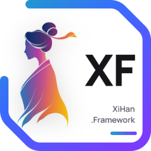

[中文](README_cn.md)

# XiHan.Framework Engineering Notes

This file is for framework developers and contributors. It documents **how the framework itself is organized**: layered architecture, module catalog, directory layout and dependencies.

If you just want to build an application with the framework, start from the [repository README](../README.md); full API and per-package documentation lives on the [documentation site](https://framework.docs.xihanfun.com).

## Architecture Overview

The framework is organized into strict modular layers. Dependencies between modules are enforced by the `[DependsOn]` attribute and loaded in topological order:

```text
┌─────────────────────────────────────────────────────────────────┐
│                          7. Web Layer                           │
│  Web.Docs → Web.Api → Web.Core    Web.Gateway    Web.RealTime   │
│                                   Web.Grpc       Web.Mcp        │
├─────────────────────────────────────────────────────────────────┤
│                     6. Infrastructure Layer                     │
│  Data  Uow  Caching  EventBus  Auditing  Logging                │
│  Authentication  Authorization  AI  Bot  Workflow  Tasks        │
│  Traffic  Upgrade  Messaging  ObjectStorage  SearchEngines      │
│  Observability  Serialization  Script  Http  Castle             │
├─────────────────────────────────────────────────────────────────┤
│                      5. Application Layer                       │
│  Application → Application.Contracts                            │
│  MultiTenancy → MultiTenancy.Abstractions                       │
│  Validation → Validation.Abstractions   Settings   Security     │
├─────────────────────────────────────────────────────────────────┤
│                         4. Domain Layer                         │
│  Domain → Domain.Shared                                         │
├─────────────────────────────────────────────────────────────────┤
│                          3. Core Layer                          │
│  Core (module system / DI / lifecycle / options / exceptions)   │
├─────────────────────────────────────────────────────────────────┤
│                        2. Metadata Layer                        │
│  Metadata (framework info / version / platform)                 │
├─────────────────────────────────────────────────────────────────┤
│                         1. Common Layer                         │
│  Utils (general-purpose utilities, zero third-party deps)       │
└─────────────────────────────────────────────────────────────────┘
```

### Naming Conventions

- `XiHan.Framework.[ModuleName]` — general-purpose library, uses `Microsoft.NET.Sdk`
- `XiHan.Framework.Web.[ModuleName]` — web-facing feature, uses `Microsoft.NET.Sdk.Web`
- `XiHan.Framework.[ModuleName].Abstractions` — contracts only, no implementation, so third parties can supply their own
- `XiHan.Framework.[ModuleName].[Provider]` — a concrete provider for one abstraction package (e.g. `EventBus.Kafka`)

## Module Catalog

66 modules, one per project under `framework/src`; package names match project names.

### Common and Core

| Module | Description |
| --- | --- |
| `Metadata` | Framework metadata: name, version, author, organization, supported platforms |
| `Utils` | General-purpose utilities (zero third-party dependencies): strings, cryptography, async, serialization, collections, reflection, networking, file IO, math, time |
| `Analyzers` | Roslyn analyzers: file-header convention check with a code fix (`XiHanFileHeaderAnalyzer` + CodeFixProvider), enforced at compile time |
| `Core` | Modularity engine: `IXiHanModule` base type, `[DependsOn]` declarations, topological loading, 7 lifecycle hooks, DI extensions, options pattern, exception handling chain |

### Domain and Application

| Module | Description |
| --- | --- |
| `Domain.Shared` | Shared domain models: base entity types, enums, constants, value objects, exceptions |
| `Domain` | DDD domain layer: aggregate roots, entities, domain services, domain events, specifications, repository abstractions, business rule engine |
| `Application.Contracts` | Application service contracts: DTO definitions and service interfaces |
| `Application` | Application layer: application service base types, CRUD / batch CRUD bases, the `[DynamicApi]` attribute, Mapster DTO mapping |

### Infrastructure

| Module | Description |
| --- | --- |
| `Data` | SqlSugar data access: repositories, unit-of-work integration, multi-tenant data isolation, per-module databases, automatic table creation on startup |
| `Uow` | Unit of work: AOP interceptors manage transaction boundaries |
| `Caching` | Hybrid caching: HybridCache (memory + Redis), caching interceptor, tenant awareness |
| `Authentication` | Authentication: JWT / OAuth2 / OIDC, token factory, MFA, SSO |
| `Authorization` | Authorization: RBAC, policy-based, claims-based |
| `Security` | Security and cryptography: BouncyCastle primitives, key management, password hashing, data protection |
| `Auditing` | Audit logging: collection pipeline for operation / access / login / exception / API / entity-change logs, async queue, masking and write contracts |
| `EventBus.Abstractions` | Event bus abstractions: publish/subscribe interfaces, handler pipeline |
| `EventBus` | Event bus: local and distributed events, outbox pattern, event store (built-in implementation; brokers come from the sub-packages below) |
| `EventBus.RabbitMQ` | RabbitMQ provider for the distributed event bus |
| `EventBus.Kafka` | Kafka provider for the distributed event bus |
| `EventBus.Redis` | Redis (Streams) provider for the distributed event bus |
| `Workflow.Abstractions` | Workflow abstractions: definition model, activity contracts, runtime instance and bookmark models, storage ports, human-task contracts; no execution logic |
| `Workflow` | Workflow engine: graph execution engine, built-in activity set, human tasks (approvals), expression evaluation, timer scheduling, in-memory store by default |
| `Castle` | AOP dynamic proxy: Castle DynamicProxy integration and interceptor registration |
| `Logging` | Structured logging: Serilog integration, file/console sinks, async writes |
| `Serialization` | Serialization: dynamic JSON manipulation and `JsonSerializerOptions` composition on System.Text.Json |
| `Http` | HTTP client: Polly resilience (retry / circuit breaker), request pipeline |
| `Localization.Abstractions` | Localization abstractions: the `IStringLocalizer` layer |
| `Localization` | Localization: multi-language resource files, runtime culture switching |
| `MultiTenancy.Abstractions` | Multi-tenancy abstractions: tenant context interfaces, resolution chain |
| `MultiTenancy` | Multi-tenancy: tenant resolution middleware, data isolation, tenant configuration, lifecycle |
| `Settings` | Settings management: definition-provider pattern, dynamic configuration, multiple sources (including tenant level) |
| `Validation.Abstractions` | Validation abstractions: the `IHasValidationErrors` contract and `XiHanValidationException` |
| `Validation` | Validation integration entry point: currently a thin placeholder, module class only |
| `ObjectMapping` | Object mapping: Mapster integration |
| `ObjectStorage` | Object storage: one abstraction over local disk, Aliyun OSS, MinIO and Tencent COS |
| `VirtualFileSystem` | Virtual file system: physical directories and embedded assembly resources mounted by priority, file watching, in-memory version snapshots and rollback (no cloud storage — that is `ObjectStorage`) |
| `Messaging` | Message routing abstraction: envelope → channel routing → hand off to a sender; no channel implementations |
| `DistributedIds` | Distributed IDs: Snowflake / NanoId / SequentialGuid generators plus Sqids short-code encoding, zero third-party dependencies |
| `Threading` | Concurrency context: unified `CancellationToken` access with temporary overrides, `AsyncLocal`-based ambient data context and nestable ambient scopes |
| `Timing` | Time policy: time zone management, time abstraction |
| `Templating` | Template rendering: Scriban engine, template registry |
| `Tasks` | Scheduled tasks and background jobs: scheduling engine, background services, tenant awareness |
| `Traffic` | Traffic governance: gray routing (rule engine with header / IP / percentage / tenant / user matchers); rate limiting and circuit breaking are policy interfaces only |
| `Upgrade` | Upgrade engine: version store, migration execution, distributed lock, automatic check on startup |
| `AI.Abstractions` | AI abstractions: agents, chat, configuration, guardrails, prompts, RAG, skills |
| `AI` | AI integration: Microsoft.Extensions.AI model abstraction, Microsoft.Agents.AI agent framework, MCP protocol support |
| `Bot` | Bot core: multi-channel dispatch pipeline, policies and templates; channels come from the sub-packages below |
| `Bot.Email` | Bot email channel, built on MailKit |
| `Bot.Sms` | Bot SMS channel |
| `Bot.Telegram` | Bot Telegram channel, built on Telegram.Bot |
| `Bot.DingTalk` | Bot DingTalk channel |
| `Bot.Lark` | Bot Lark channel |
| `Bot.WeCom` | Bot WeCom channel |
| `Script` | C# scripting engine: Roslyn in-memory compilation, compilation cache, execution timeout, post-compile static safety checks (not a process-level sandbox; C# only) |
| `SearchEngines.Abstractions` | Search abstractions: one contract for indexes, documents, queries and results; zero third-party dependencies |
| `SearchEngines` | In-process fallback search: index management, keyword matching, filtering and sorting; no tokenization or relevance model |
| `SearchEngines.Elasticsearch` | Elasticsearch implementation of the search contracts |
| `Observability` | Observability: health checks, performance counters, metrics, OpenTelemetry tracing |
| `DevTools` | Development tooling: helpers and debugging aids for development time |

### Web Layer

| Module | Description |
| --- | --- |
| `Web.Core` | Web infrastructure: hosting environment, middleware pipeline, CORS, IP geolocation (ip2region), user-agent parsing |
| `Web.Api` | Dynamic APIs: automatic discovery and registration, OpenAPI security, full middleware pipeline (TraceId → request context → exception logging → routing → CORS → authentication → tenant resolution → authorization → controllers) |
| `Web.Docs` | API documentation: Scalar UI + Swagger UI, dynamic API group discovery |
| `Web.Gateway` | API gateway: gray routing, request tracing, gateway-level exception handling; rate limiting and circuit breaking are configuration switches |
| `Web.Grpc` | gRPC service integration |
| `Web.Mcp` | MCP server: AI skills exposed as MCP tools over HTTP, authenticated with an application management key |
| `Web.RealTime` | Realtime communication: SignalR integration, JSON serialization |

## Module Dependencies

The core dependency chain, bottom-up:

```text
Utils (zero third-party deps)
  └── Metadata (zero third-party deps)
        └── Core
              ├── Serialization
              ├── Security ──→ Authentication ──→ Authorization
              ├── Threading
              ├── Timing
              ├── DistributedIds
              ├── VirtualFileSystem ──→ Localization
              ├── Uow
              │     ├── Caching (+ Redis)
              │     └── EventBus ──→ EventBus.RabbitMQ / Kafka / Redis
              ├── Domain.Shared ──→ Domain ──→ Data (SqlSugar)
              │     └── Application.Contracts ──→ Application
              ├── MultiTenancy.Abstractions ──→ MultiTenancy
              │     ├── Tasks
              │     ├── Traffic
              │     └── Upgrade
              ├── Workflow.Abstractions ──→ Workflow
              ├── SearchEngines.Abstractions ──→ SearchEngines ──→ SearchEngines.Elasticsearch
              ├── Http (+ Polly) ──→ AI (Microsoft.Extensions.AI + Agents.AI + MCP)
              │     └── Bot (MailKit + Telegram)
              └── Web.Core
                    ├── Web.Api ──→ Web.Docs (Scalar + Swagger)
                    ├── Web.Gateway
                    ├── Web.Grpc
                    ├── Web.Mcp (MCP Server)
                    └── Web.RealTime (SignalR)
```

## Repository Layout

```text
XiHan.Framework/
├── framework/
│   ├── XiHan.Framework.slnx               # solution file
│   ├── src/                               # sources (66 modules)
│   │   ├── XiHan.Framework.Utils/         #   utilities
│   │   ├── XiHan.Framework.Metadata/      #   framework metadata
│   │   ├── XiHan.Framework.Core/          #   modularity core
│   │   ├── XiHan.Framework.Domain.Shared/ #   shared domain
│   │   ├── XiHan.Framework.Domain/        #   domain layer
│   │   ├── XiHan.Framework.Application.Contracts/ # application contracts
│   │   ├── XiHan.Framework.Application/   #   application layer
│   │   ├── XiHan.Framework.Data/          #   data access
│   │   ├── XiHan.Framework.Web.Core/      #   web core
│   │   ├── XiHan.Framework.Web.Api/       #   dynamic APIs
│   │   └── ...                            #   other modules
│   ├── test/                              # tests (one per src project, 66 unit-test projects)
│   │   ├── XiHan.Framework.Utils.Tests/   #   utilities tests
│   │   ├── XiHan.Framework.Core.Tests/    #   core tests
│   │   └── ...                            #   the rest follow <Project>.Tests
│   ├── sample/                            # runnable sample hosts (not test projects)
│   │   ├── XiHan.Framework.Web.Host/      #   web sample host (dynamic APIs + docs)
│   │   └── XiHan.Framework.Integration.Host/ # module composition sample host
│   ├── tool/                              # tooling
│   │   └── Region/                        #   code normalization tool
│   ├── props/                             # shared MSBuild properties
│   ├── scripts/                           # NuGet publishing and ops scripts
│   └── nupkgs/                            # NuGet package output
├── docs/                                  # documentation site (VitePress, framework.docs.xihanfun.com)
└── assets/                                # README assets
```

## Building and Testing Locally

> Requires the .NET SDK **10.0.1xx** feature band (`global.json` pins it with `rollForward: latestPatch`). With 10.0.4xx installed you will get "SDK not found" and nothing builds.

```bash
# Restore and build
dotnet restore framework/XiHan.Framework.slnx
dotnet build framework/XiHan.Framework.slnx --configuration Release

# Full test run (MTP mode)
dotnet test --solution framework/XiHan.Framework.slnx --configuration Release
```

CI additionally collects coverage and enforces a coverage gate — see [.github/workflows/ci.yml](../.github/workflows/ci.yml).
