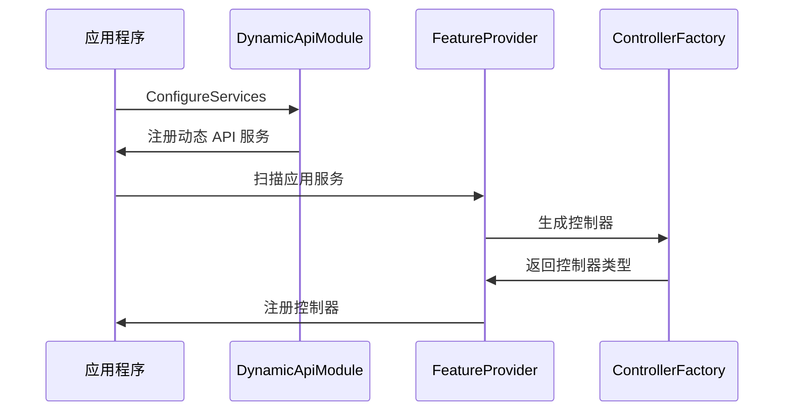
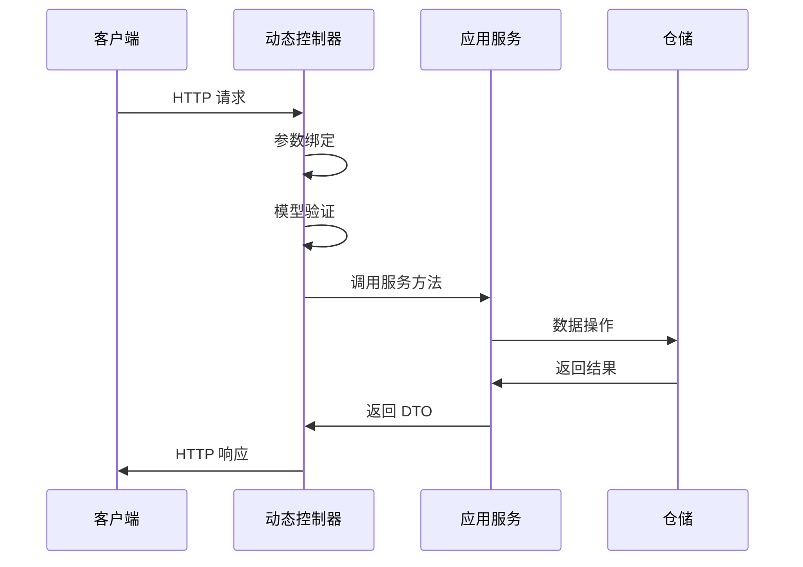
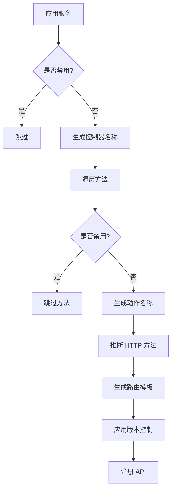

# 动态 WebAPI 架构设计

## 🏗️ 架构概览

动态 WebAPI 功能是 XiHan.Framework 的核心特性之一，它采用约定优于配置的设计理念，通过自动发现和映射应用服务到 REST API，极大地简化了 Web API 的开发流程。

## 📐 架构层次

```
┌─────────────────────────────────────────────────────────────┐
│                     表现层 (Presentation Layer)              │
│  ┌─────────────────────────────────────────────────────┐   │
│  │         动态生成的 REST API 控制器                    │   │
│  │  (DynamicApiController - 运行时生成)                  │   │
│  └─────────────────────────────────────────────────────┘   │
└─────────────────────────────────────────────────────────────┘
                            ↓
┌─────────────────────────────────────────────────────────────┐
│                   应用层 (Application Layer)                 │
│  ┌──────────────────────┐  ┌──────────────────────┐        │
│  │  应用服务接口         │  │  CRUD 应用服务        │        │
│  │  IApplicationService │  │  ICrudAppService     │        │
│  └──────────────────────┘  └──────────────────────┘        │
│  ┌──────────────────────┐  ┌──────────────────────┐        │
│  │  应用服务基类         │  │  批量操作服务         │        │
│  │  ApplicationBase     │  │  IBatchCrudAppService│        │
│  └──────────────────────┘  └──────────────────────┘        │
└─────────────────────────────────────────────────────────────┘
                            ↓
┌─────────────────────────────────────────────────────────────┐
│              动态 API 基础设施 (Infrastructure)              │
│  ┌──────────────────────┐  ┌──────────────────────┐        │
│  │  约定规则引擎         │  │  控制器生成器         │        │
│  │  Convention Engine   │  │  Controller Factory  │        │
│  └──────────────────────┘  └──────────────────────┘        │
│  ┌──────────────────────┐  ┌──────────────────────┐        │
│  │  路由配置器           │  │  参数绑定器           │        │
│  │  Route Configurator  │  │  Parameter Binder    │        │
│  └──────────────────────┘  └──────────────────────┘        │
│  ┌──────────────────────┐  ┌──────────────────────┐        │
│  │  版本控制管理器       │  │  批量操作处理器       │        │
│  │  Version Manager     │  │  Batch Handler       │        │
│  └──────────────────────┘  └──────────────────────┘        │
└─────────────────────────────────────────────────────────────┘
                            ↓
┌─────────────────────────────────────────────────────────────┐
│                    领域层 (Domain Layer)                     │
│  ┌──────────────────────┐  ┌──────────────────────┐        │
│  │  实体 (Entities)      │  │  聚合根 (Aggregates) │        │
│  └──────────────────────┘  └──────────────────────┘        │
│  ┌──────────────────────┐  ┌──────────────────────┐        │
│  │  仓储接口 (IRepository)│ │  规约 (Specifications)│        │
│  └──────────────────────┘  └──────────────────────┘        │
└─────────────────────────────────────────────────────────────┘
```

## 🔑 核心组件

### 1. 应用服务层

#### 1.1 IApplicationService

```csharp
/// <summary>
/// 应用服务标记接口
/// 实现此接口的服务将自动暴露为 REST API
/// </summary>
public interface IApplicationService : IRemoteService
{
}
```

**设计考虑：**

- 继承自 `IRemoteService`，标记可远程访问的服务
- 作为标记接口，用于服务发现
- 支持依赖注入和生命周期管理

#### 1.2 ICrudApplicationService

```csharp
/// <summary>
/// CRUD 应用服务接口
/// 提供标准的增删改查操作
/// </summary>
public interface ICrudApplicationService<TEntityDto, TKey>
{
    Task<TEntityDto?> GetAsync(TKey id);
    Task<PageResponseDto<TEntityDto>> GetListAsync(PageQuery input);
    Task<TEntityDto> CreateAsync(TEntityDto input);
    Task<TEntityDto> UpdateAsync(TKey id, TEntityDto input);
    Task<bool> DeleteAsync(TKey id);
}
```

**设计考虑：**

- 遵循 RESTful 设计原则
- 支持分页查询
- 泛型设计，适用于各种实体类型
- 异步操作，提升性能

#### 1.3 ApplicationServiceBase

```csharp
/// <summary>
/// 应用服务基类
/// 提供通用功能和依赖注入
/// </summary>
public abstract class ApplicationServiceBase : IApplicationService
{
    public ICachedServiceProvider ServiceProvider { get; set; }
    protected ILogger Logger => LazyLogger.Value;
}
```

**设计考虑：**

- 提供服务提供者访问
- 延迟加载日志记录器
- 支持属性注入

### 2. 动态 API 约定引擎

#### 2.1 IDynamicApiConvention

```csharp
/// <summary>
/// 动态 API 约定接口
/// 定义路由生成、HTTP 方法映射等规则
/// </summary>
public interface IDynamicApiConvention
{
    void Apply(DynamicApiConventionContext context);
}
```

**设计考虑：**

- 可扩展的约定系统
- 支持自定义规则
- 链式处理机制

#### 2.2 DefaultDynamicApiConvention

```csharp
/// <summary>
/// 默认约定实现
/// 提供开箱即用的约定规则
/// </summary>
public class DefaultDynamicApiConvention : IDynamicApiConvention
{
    // 路由生成规则
    // HTTP 方法推断规则
    // 参数绑定规则
    // 命名转换规则
}
```

**约定规则：**

| 方法前缀 | HTTP 方法 | 路由模板        | 说明     |
| -------- | --------- | --------------- | -------- |
| Get      | GET       | /resource/{id?} | 查询操作 |
| Create   | POST      | /resource       | 创建操作 |
| Update   | PUT       | /resource/{id}  | 更新操作 |
| Delete   | DELETE    | /resource/{id}  | 删除操作 |
| Patch    | PATCH     | /resource/{id}  | 部分更新 |

### 3. 控制器生成器

#### 3.1 DynamicApiControllerFactory

```csharp
/// <summary>
/// 动态控制器工厂
/// 使用反射发出 (Reflection.Emit) 在运行时生成控制器
/// </summary>
public static class DynamicApiControllerFactory
{
    public static Type? CreateControllerType(Type serviceType)
    {
        // 1. 创建 TypeBuilder
        // 2. 添加 ApiController 和 Route 特性
        // 3. 创建构造函数，注入应用服务
        // 4. 为每个服务方法创建对应的动作方法
        // 5. 返回生成的控制器类型
    }
}
```

**技术实现：**

- 使用 `System.Reflection.Emit` 动态生成 IL 代码
- 创建继承自 `ControllerBase` 的控制器类
- 自动添加必要的特性和路由
- 代理调用应用服务方法

#### 3.2 DynamicApiControllerFeatureProvider

```csharp
/// <summary>
/// 控制器特性提供者
/// 集成到 ASP.NET Core 的应用程序部件系统
/// </summary>
public class DynamicApiControllerFeatureProvider : IApplicationFeatureProvider<ControllerFeature>
{
    public void PopulateFeature(IEnumerable<ApplicationPart> parts, ControllerFeature feature)
    {
        // 1. 扫描所有应用服务
        // 2. 为每个服务生成控制器
        // 3. 添加到控制器特性集合
    }
}
```

### 4. 批量操作支持

#### 4.1 批量操作请求模型

```csharp
/// <summary>
/// 批量操作请求
/// </summary>
public class BatchOperationRequest<T>
{
    public List<T> Items { get; set; }
    public bool ContinueOnError { get; set; }
    public bool UseTransaction { get; set; }
}
```

**设计特点：**

- 支持事务控制
- 支持错误处理策略
- 统一的请求格式

#### 4.2 批量操作响应模型

```csharp
/// <summary>
/// 批量操作响应
/// </summary>
public class BatchOperationResponse<T>
{
    public int SuccessCount { get; set; }
    public int FailureCount { get; set; }
    public List<BatchOperationResult<T>> Results { get; set; }
    public List<string> Errors { get; set; }
}
```

**设计特点：**

- 详细的执行结果
- 支持部分成功场景
- 错误信息收集

### 5. API 版本控制

#### 5.1 版本特性

```csharp
[ApiVersion("1.0")]
public class UserV1AppService { }

[ApiVersion("2.0")]
public class UserV2AppService { }
```

**版本策略：**

- URL 路径版本化: `/api/v1/users`
- 查询字符串版本化: `/api/users?api-version=1.0`
- 请求头版本化: `X-API-Version: 1.0`
- 支持版本弃用标记

## 🔄 工作流程

### 1. 应用启动阶段



### 2. 请求处理阶段



### 3. 约定应用流程



## 📊 设计模式

### 1. 工厂模式 (Factory Pattern)

- **DynamicApiControllerFactory**: 动态创建控制器实例
- **优势**: 封装复杂的创建逻辑，支持运行时类型生成

### 2. 约定优于配置 (Convention over Configuration)

- **默认约定**: 自动推断路由、HTTP 方法
- **优势**: 减少配置工作，提升开发效率

### 3. 策略模式 (Strategy Pattern)

- **IDynamicApiConvention**: 可替换的约定策略
- **优势**: 灵活的规则定制，易于扩展

### 4. 模板方法模式 (Template Method Pattern)

- **ApplicationServiceBase**: 定义服务执行流程
- **优势**: 统一的处理逻辑，子类只需实现特定步骤

### 5. 装饰器模式 (Decorator Pattern)

- **特性标注**: 通过特性增强功能
- **优势**: 灵活的功能组合，不影响核心逻辑

### 6. 建造者模式 (Builder Pattern)

- **DynamicApiOptions**: 流式配置 API
- **优势**: 清晰的配置接口，易于理解

## 🎯 设计原则

### 1. 单一职责原则 (SRP)

- 每个类只负责一个功能领域
- 应用服务只负责业务逻辑
- 控制器只负责请求响应

### 2. 开闭原则 (OCP)

- 对扩展开放：支持自定义约定、自定义控制器
- 对修改关闭：核心逻辑稳定，通过扩展点添加功能

### 3. 里氏替换原则 (LSP)

- 基类可以被子类替换
- 所有应用服务基类都可互换使用

### 4. 接口隔离原则 (ISP)

- 提供细粒度的接口
- `ICrudApplicationService` vs `IBatchCrudApplicationService`

### 5. 依赖倒置原则 (DIP)

- 依赖抽象而非具体实现
- 通过接口定义契约

## 🔐 安全考虑

### 1. 输入验证

```csharp
public class CreateUserDto
{
    [Required]
    [StringLength(50)]
    public string UserName { get; set; }

    [EmailAddress]
    public string Email { get; set; }
}
```

### 2. 认证授权

```csharp
[DynamicApi]
[Authorize]
public class UserAppService
{
    [Authorize(Roles = "Admin")]
    public Task<bool> DeleteAsync(long id) { }
}
```

### 3. 限流保护

```csharp
[RateLimit(PermitLimit = 100, Window = 60)]
public class UserAppService { }
```

### 4. CORS 配置

```csharp
services.AddCors(options =>
{
    options.AddPolicy("AllowSpecificOrigin",
        builder => builder.WithOrigins("https://example.com"));
});
```

## 📈 性能优化

### 1. 控制器缓存

- 生成的控制器类型缓存在内存中
- 避免重复生成 IL 代码

### 2. 异步操作

- 所有数据访问都使用异步方法
- 提升并发处理能力

### 3. 分页查询

- 避免一次性加载大量数据
- 支持流式处理

### 4. 批量操作优化

- 使用事务减少数据库往返
- 支持并行处理

## 🧪 可测试性

### 1. 单元测试

```csharp
[Fact]
public async Task GetAsync_ExistingId_ReturnsDto()
{
    // Arrange
    var mockRepo = new Mock<IRepositoryBase<User, long>>();
    var service = new UserAppService(mockRepo.Object);

    // Act
    var result = await service.GetAsync(1);

    // Assert
    Assert.NotNull(result);
}
```

### 2. 集成测试

```csharp
[Fact]
public async Task GetUsers_ReturnsOkResult()
{
    // Arrange
    var client = _factory.CreateClient();

    // Act
    var response = await client.GetAsync("/api/users");

    // Assert
    response.EnsureSuccessStatusCode();
}
```

## 📚 扩展点

### 1. 自定义约定

实现 `IDynamicApiConvention` 接口

### 2. 自定义控制器

继承 `XiHanController` 或 `ControllerBase`

### 3. 自定义特性

创建继承自 `Attribute` 的自定义特性

### 4. 自定义中间件

实现 ASP.NET Core 中间件

## 🌟 最佳实践总结

1. ✅ **使用强类型 DTO**：避免直接暴露实体
2. ✅ **分离读写操作**：CQRS 模式
3. ✅ **统一错误处理**：全局异常过滤器
4. ✅ **完善的日志记录**：便于问题排查
5. ✅ **API 版本管理**：平滑升级
6. ✅ **完整的文档**：Swagger/OpenAPI
7. ✅ **性能监控**：APM 工具集成
8. ✅ **安全防护**：认证、授权、限流

## 🔮 未来展望

1. 🚀 **GraphQL 支持**：动态生成 GraphQL Schema
2. 🚀 **gRPC 支持**：自动生成 gRPC 服务
3. 🚀 **WebSocket 支持**：实时通信能力
4. 🚀 **代码生成工具**：CLI 工具
5. 🚀 **性能分析**：内置性能监控
6. 🚀 **自动化测试**：测试用例生成

---

## 📖 相关文档

- [动态 WebAPI 使用文档](./DynamicWebAPI.md)
- [动态 WebAPI 示例](./DynamicWebAPI-Examples.md)
- [应用服务开发指南](./ApplicationServices.md)
- [框架架构说明](./1.Architecture.md)
